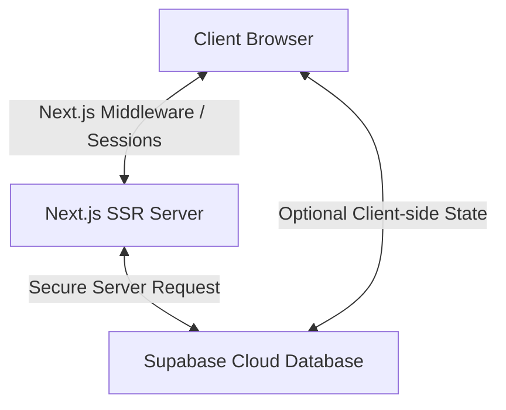

# 🏥 Health App (헬스 앱) - 프로젝트 백그라운드

이 문서는 **Health App** 프로젝트의 기획 배경, 핵심 가치, 기술 스택 선정 이유 등 전반적인 프로젝트 배경지식을 담고 있는 소개 문서입니다. 
*실무 개발 규칙 및 CLI 명령어는 [CLAUDE.md](file:///Users/ryuhojun/Documents/project/health_app/CLAUDE.md)에서 확인하실 수 있습니다.*

---

## 📌 1. 프로젝트 개요 & 배경
**Health App**은 사용자가 자신의 건강 상태를 기록하고, 맞춤형 피드백을 제공받으며, 지속 가능한 건강 관리 습관을 형성할 수 있도록 돕는 풀스택 웹 애플리케이션입니다.

### 🎯 주요 타겟 & 목적
* **개인화된 건강 관리**: 일일 운동량, 식단, 수면 패턴 등 건강 데이터를 직관적으로 시각화합니다.
* **지속 가능한 동기부여**: 유저가 지치지 않고 목표를 달성할 수 있도록 루틴 관리 시스템을 제공합니다.

---

## 🛠️ 2. 기술 스택 아키텍처 & 선정 이유

본 프로젝트는 서비스 확장성과 효율적인 리소스 관리를 위해 **Next.js**와 **Supabase**의 조합을 선택했습니다.

### 1) Next.js 15+ (App Router)
* **서버사이드 렌더링 (SSR)**: 건강 정보는 개인 정보이므로 클라이언트에 민감한 로직이 노출되지 않아야 합니다. SSR을 통해 서버에서 보안성 높은 데이터를 미리 연산하여 내려줍니다.
* **강력한 미들웨어**: 로그인 상태에 따라 사용자별 건강 대시보드 접근 권한을 미들웨어단에서 즉시 제어할 수 있습니다.

### 2) Supabase (Backend as a Service)
* **PostgreSQL 기반**: 복잡하고 정밀한 관계형 데이터 구조(유저 피드백, 날짜별 건강 추이 등)를 유연하게 쿼리할 수 있습니다.
* **쿠키 기반 SSR 인증(Auth)**: `@supabase/ssr` 라이브러리를 통해 서버 컴포넌트 환경에서도 끊김 없는 인증 상태를 유지할 수 있어 고도로 최적화된 UX를 제공합니다.

### 3) Vercel 배포 플랫폼
* Next.js와의 완벽한 호환성 덕분에 별도의 서버 인프라 구축 없이 가볍게 시작(Zero-config)할 수 있으며, 서버리스 함수(Serverless Functions) 성능이 뛰어나 트래픽 증가에도 안정적입니다.

---

## 🗺️ 3. 핵심 기능 로드맵 (Roadmap)
* [ ] **대시보드**: 하루 건강 스코어 및 요약 데이터 제공
* [ ] **식단 & 운동 기록**: 날짜별 칼로리/루틴 등록 및 DB 연동
* [ ] **인증 시스템**: Supabase Auth를 활용한 이메일/소셜 로그인 구현
* [ ] **통계 & 리포트**: 주간/월간 단위 건강 데이터 추이 시각화
