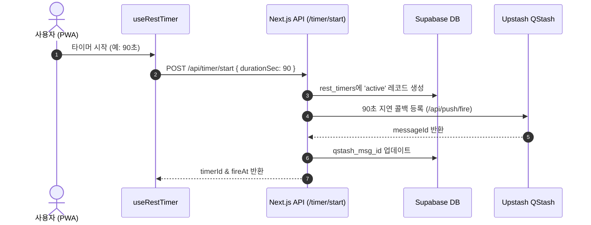
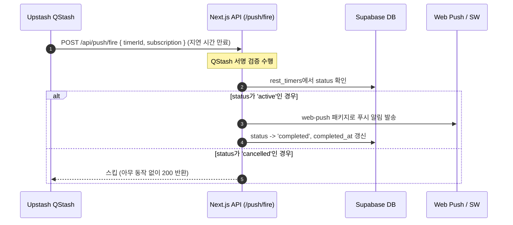

# ⏱️ 운동 휴식 타이머 알림 시스템 아키텍처

운동 세트 완료 후 휴식 시간(최대 5분)이 경과하면 앱이 백그라운드에 있어도 PWA 푸시 알림을 수신할 수 있도록 구현된 시스템입니다.

---

## 🛠️ 기술 스택 및 구성 요소
*   **프레임워크**: Next.js 15+ (App Router)
*   **데이터베이스**: Supabase (PostgreSQL)
*   **지연 큐 (Delayed Queue)**: Upstash QStash
*   **푸시 발송**: `web-push` 라이브러리
*   **클라이언트**: PWA Service Worker (`sw.js`)

---

## 📊 데이터베이스 스키마

### 1) `push_subscriptions` 테이블
유저의 PWA 푸시 구독 정보(`endpoint`, `keys_p256dh`, `keys_auth`)를 영구 저장합니다. RLS 정책으로 본인 구독만 접근 가능합니다.

```sql
CREATE TABLE push_subscriptions (
  id          UUID DEFAULT gen_random_uuid() PRIMARY KEY,
  user_id     UUID REFERENCES auth.users(id) ON DELETE CASCADE,
  endpoint    TEXT NOT NULL,
  keys_p256dh TEXT NOT NULL,
  keys_auth   TEXT NOT NULL,
  created_at  TIMESTAMPTZ DEFAULT now(),
  
  UNIQUE(user_id, endpoint)
);

-- RLS: 본인의 구독만 관리
ALTER TABLE push_subscriptions ENABLE ROW LEVEL SECURITY;

CREATE POLICY "사용자 본인의 구독만 조회/관리"
  ON push_subscriptions FOR ALL
  USING (auth.uid() = user_id)
  WITH CHECK (auth.uid() = user_id);
```

### 2) `rest_timers` 테이블
타이머 상태(`active` / `cancelled` / `completed`), 발송 예정 시각(`fire_at`), QStash 메시지 ID(`qstash_msg_id`)를 저장합니다. QStash 콜백 시 이 테이블을 조회하여 발송 여부를 결정합니다.

```sql
CREATE TYPE timer_status AS ENUM ('active', 'cancelled', 'completed');

CREATE TABLE rest_timers (
  id            UUID DEFAULT gen_random_uuid() PRIMARY KEY,
  user_id       UUID REFERENCES auth.users(id) ON DELETE CASCADE,
  duration_sec  INT NOT NULL CHECK (duration_sec > 0 AND duration_sec <= 300),
  status        timer_status DEFAULT 'active',
  qstash_msg_id TEXT,         -- QStash 메시지 ID (디버깅용)
  fire_at       TIMESTAMPTZ NOT NULL,  -- 알림 발송 예정 시각
  created_at    TIMESTAMPTZ DEFAULT now(),
  completed_at  TIMESTAMPTZ   -- 실제 발송 또는 취소된 시각
);

-- RLS: 본인의 타이머만 관리
ALTER TABLE rest_timers ENABLE ROW LEVEL SECURITY;

CREATE POLICY "사용자 본인의 타이머만 조회/관리"
  ON rest_timers FOR ALL
  USING (auth.uid() = user_id)
  WITH CHECK (auth.uid() = user_id);

-- 인덱스: fire 콜백 시 빠른 조회
CREATE INDEX idx_rest_timers_status ON rest_timers (id) WHERE status = 'active';
```

---

## 🔄 동작 흐름

### 1) 타이머 시작 및 예약 흐름


1. **[클라이언트]** `useRestTimer.start(durationSec)` 호출.
2. **[Next.js API]** `POST /api/timer/start` 수신:
   - Supabase `rest_timers`에 `status: 'active'` 상태로 행 삽입.
   - Upstash QStash에 `durationSec`초 만큼의 지연 메시지 예약 (콜백 타겟: `/api/push/fire`).
   - 발급된 QStash `messageId`를 DB에 기입.
3. **[클라이언트]** 반환된 정보를 기반으로 로컬 카운트다운 타이머 UI 갱신 시작 (앱을 닫아도 백그라운드 발송은 무관).

### 2) 타이머 완료 (푸시 알림 발송) 흐름


1. **[QStash]** 지정된 지연 시간이 지나면 `/api/push/fire` 엔드포인트를 HTTP POST로 자동 호출.
2. **[Next.js API]** `/api/push/fire` 수신:
   - **QStash 서명 검증** (`Upstash-Signature` 헤더 검사로 악성 호출 차단).
   - **RLS 우회 (Bypass RLS)**: QStash 콜백은 세션 쿠키가 없는 외부 비인증 요청입니다. 따라서 일반 `createClient` 대신 `createAdminClient()`(`SUPABASE_SERVICE_ROLE_KEY` 사용)를 통해 `rest_timers` 테이블의 타이머 상태를 안전하게 조회합니다.
   - DB에서 `status === 'active'`이면 `web-push`를 사용하여 구독 단말에 푸시 알림 전송 후, 상태를 `completed`로 전환.
   - `status !== 'active'`(예: 취소됨)이면 스킵하고 200 응답만 반환 (멱등성 보장).

### 3) 타이머 취소 흐름 (건너뛰기)
1. **[클라이언트]** `useRestTimer.cancel()` 호출.
2. **[Next.js API]** `POST /api/timer/cancel`:
   - 해당 `timerId` 레코드의 `status`를 `'cancelled'`로 업데이트.
   - `completed_at` 기록.
3. **결과**: 추후 QStash 콜백이 발동하더라도 DB 상태가 `cancelled`이므로 실제 푸시 발송은 자동 생략됩니다.

### 4) 클라이언트 타이머 백그라운드 동기화 및 정밀도 보정 (PWA/모바일 최적화)
모바일 기기 및 브라우저 환경에서는 앱이 백그라운드로 전환될 때 전력 소모를 줄이기 위해 `setInterval`과 같은 자바스크립트 타이머의 작동이 극도로 제한되거나 일시 정지(Throttling)됩니다. 이를 극복하고 앱 복귀 시 정확한 카운트다운을 유지하기 위해 다음 메커니즘을 적용했습니다.

*   **절대 시각 기반 카운트다운 (Absolute Time Tracking)**:
    *   단순히 1초마다 변수를 감산하는 방식은 백그라운드 대기 시 타이머가 멈추는 오차가 발생합니다.
    *   타이머 시작 시 종료되어야 하는 절대 시각(`endTime = Date.now() + seconds * 1000`)을 기록합니다.
    *   폴링 돌 때마다 `Math.ceil((endTime - Date.now()) / 1000)` 연산을 수행하여 현재 실제 시간 대비 남은 초를 매번 보정합니다.
*   **초정밀 100ms 폴링**:
    *   UI 갱신의 부드러움과 즉각적인 반응을 보장하기 위해 1초가 아닌 `100ms` 주기로 남은 시간을 감지하고 갱신합니다.
*   **Visibility API 즉각 동기화 (`visibilitychange`)**:
    *   사용자가 앱을 완전히 닫거나 다른 앱을 보다가 복귀할 때(`document.visibilityState === 'visible'`), `setInterval`이 재개되기 전이나 딜레이 없이 **즉시** `Date.now()`를 활용해 남은 시간을 재계산하고 상태를 갱신합니다. 만약 복귀한 시점에 이미 완료 시간이 지났다면 즉시 완료(`done`) 상태로 전환됩니다.

---

## 📁 관련 파일 목록

*   **[`src/utils/supabase/server.ts`](file:///Users/ryuhojun/Documents/project/health_app/src/utils/supabase/server.ts)**: 일반 쿠키 기반 클라이언트(`createClient`) 및 백그라운드 작업용 RLS 우회 관리자 클라이언트(`createAdminClient`) 생성을 담당하는 헬퍼.
*   **[`src/utils/supabase/middleware.ts`](file:///Users/ryuhojun/Documents/project/health_app/src/utils/supabase/middleware.ts)**: 요청 경로별 세션 제어 및 페이지 보호 미들웨어. `/api/push/fire` 및 서비스 워커 에셋은 DB 조회 전에 조기 허용하도록 최적화되어 있습니다.
*   **[`src/providers/PushProvider.tsx`](file:///Users/ryuhojun/Documents/project/health_app/src/providers/PushProvider.tsx)**: 앱 전역 푸시 알림 구독 상태 관리 Context.
*   **[`src/hooks/useRestTimer.ts`](file:///Users/ryuhojun/Documents/project/health_app/src/hooks/useRestTimer.ts)**: 클라이언트 측 카운트다운 타이머 및 시작/취소 API 래핑 훅.
*   **[`src/app/api/timer/start/route.ts`](file:///Users/ryuhojun/Documents/project/health_app/src/app/api/timer/start/route.ts)**: 타이머 생성 및 QStash 예약.
*   **[`src/app/api/timer/cancel/route.ts`](file:///Users/ryuhojun/Documents/project/health_app/src/app/api/timer/cancel/route.ts)**: 타이머 DB 상태를 `cancelled`로 변경.
*   **[`src/app/api/push/fire/route.ts`](file:///Users/ryuhojun/Documents/project/health_app/src/app/api/push/fire/route.ts)**: QStash 콜백 수신 및 실제 푸시 발송 처리 (`createAdminClient` 사용).
*   **[`src/app/api/push/subscribe/route.ts`](file:///Users/ryuhojun/Documents/project/health_app/src/app/api/push/subscribe/route.ts)**: 푸시 구독 정보를 Supabase에 UPSERT/DELETE.
*   **[`public/sw.js`](file:///Users/ryuhojun/Documents/project/health_app/public/sw.js)**: Service Worker 내 푸시 수신(`push`) 및 알림 표시(`notificationclick`) 이벤트 제어.

---

## 📱 iOS 실기기 테스트 방법
1. Vercel 배포 URL을 iOS **Safari** 브라우저로 접속합니다.
2. 하단 공유 버튼을 눌러 **"홈 화면에 추가"**를 실행합니다.
3. 홈 화면에 설치된 PWA 아이콘으로 진입하여 알림 권한을 **허용**합니다.
4. 알림 구독 후 타이머를 시작하고 앱을 닫거나 단말 잠금을 수행해 백그라운드 푸시 동작을 확인합니다.
